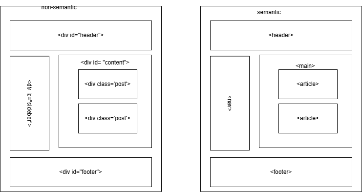

# Module 4

- some new element tags are
    
    - audio : defines an audio file
    - canvas: this is used for rendering dynamic bitmap graphics on the fly, such as graphs or games
    - command : represents a command the user can invoke(call)
    - details : represent additional info or controls which the user can obtain on demand
    - datalist : together with the a new list attribute for input can be used to make conversation
    - embed : defines external intractive content or plugin
    - video : define a video file

- new iput type introduced in html 5
  - date : selector for calander date
  - datetime-local : date and time display, with no setting or indication for time zones
  - email : input type should be email
  - month : selector for a month within a given year
  - number : a field containing a numeric value only
  - range : numeric selector within a range of values, typically visualized as a slider

## non-semantic html vs semantic(meaningful) html

### semantic tags for structure
- header> :
- nav> :
- main> :
- article> :
- section> :
- aside> :
- footer> :